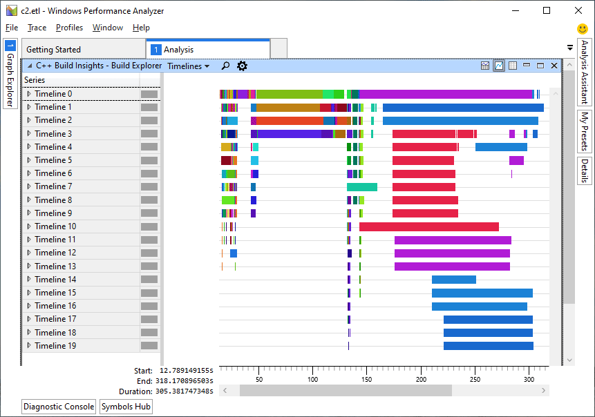

# vcperf

## Overview

vcperf is a C++ build analysis tool for the MSVC toolchain. It is built on top of C++ Build Insights, MSVC's data collection and analysis platform. Use vcperf to collect build traces that you can view in [Windows Performance Analyzer](https://docs.microsoft.com/windows-hardware/test/wpt/windows-performance-analyzer) (WPA) to understand your build times. An example of a vcperf trace viewed in WPA is shown below.

## How vcperf works

vcperf makes use of the [Event Tracing for Windows](https://docs.microsoft.com/windows/win32/etw/about-event-tracing) (ETW) relogging interface available in the [C++ Build Insights SDK](https://docs.microsoft.com/cpp/build-insights/reference/sdk/overview?view=vs-2019). This interface allows vcperf to translate an MSVC build trace into a new, customized ETW event format that is suitable for viewing in WPA. The translation process involves determining the context of each event, and emiting new events that include this information. For example, when vcperf emits an event for the code generation time of a function, it also includes the compiler or linker invocation in which the code generation took place. Having this context available allows gaining more insight from the data, such as determining the functions that took longest to generate for one particular invocation.

## Customizing vcperf to your needs

We made vcperf available as an open-source project to allow you to customize it for your own scenarios. Here are some ideas to consider when extending vcperf:

- Writing the events in a format that works with a different viewer.
- Modifying and filtering the events shown in WPA.

An example vcperf extension is shown in the following Git commit: [ba2dd59fa1ec43542be3cca3641156cd18dc98df](https://github.com/microsoft/vcperf/commit/ba2dd59fa1ec43542be3cca3641156cd18dc98df). It detects linkers that were restarted during your build due to error conditions, and highlights them in the Build Explorer view.

## Contributing

This project welcomes contributions and suggestions.  Most contributions require you to agree to a Contributor License Agreement (CLA) declaring that you have the right to, and actually do, grant us the rights to use your contribution. For details, visit https://cla.opensource.microsoft.com.

When you submit a pull request, a CLA bot will automatically determine whether you need to provide a CLA and decorate the PR appropriately (e.g., status check, comment). Simply follow the instructions provided by the bot. You will only need to do this once across all repos using our CLA.

This project has adopted the [Microsoft Open Source Code of Conduct](https://opensource.microsoft.com/codeofconduct/). For more information see the [Code of Conduct FAQ](https://opensource.microsoft.com/codeofconduct/faq/) or contact [opencode@microsoft.com](mailto:opencode@microsoft.com) with any additional questions or comments.

Note that currently, all tests for vcperf are done internally by Microsoft. All requests for contributions will need to pass these tests prior to integrating the code in the vcperf repo. Please feel free to start a pull request and we will follow up to ask for more information.

## Build and run

Following the instructions below to build and run the product.

Requirements:

- Visual Studio 2017 or later.
- Windows 8 and above.

Build steps:

1. Clone the repository on your machine.
1. Open the Visual Studio solution file.
1. vcperf relies on the C++ Build Insights SDK NuGet package. Restore NuGet packages and accept the license for the SDK.
1. Build the desired configuration. Available platforms are x86 and x64, and available configurations are *Debug* and *Release*.

Running vcperf:

1. vcperf requires *CppBuildInsights.dll* and *KernelTraceControl.dll* to run. These files are available in the C++ Build Insights NuGet package. When building vcperf, they are automatically copied next to it in the output directory. If you are going to move vcperf around on your machine, please be sure to move these DLL's along with it.
1. Launch an elevated command prompt.
1. Use vcperf according to the [Command-line reference](#command-line-reference) below.
1. Before viewing traces in WPA, follow the instructions in [Installing the C++ Build Insights WPA add-in](#installing-wpa-add-in).

## Installing the C++ Build Insights WPA add-in

Viewing vcperf traces in WPA requires the C++ Build Insights WPA add-in. Install it by following these steps:

1. Have WPA installed on your machine, or install the latest version available here: [https://docs.microsoft.com/windows-hardware/get-started/adk-install](https://docs.microsoft.com/windows-hardware/get-started/adk-install).
1. Make sure you have restored the NuGet packages for the vcperf solution.
1. Starting from the root of your vcperf repository, find the C++ Build Insights WPA add-in at the following location: `packages\Microsoft.Cpp.BuildInsights.{version}\wpa`
1. An x86 and x64 add-in are available. Select the one that matches your WPA installation. The files are named `perf_msvcbuildinsights.dll`.
1. Copy the appropriate `perf_msvcbuildinsights.dll` file into the root of your WPA installation. The WPA root is typically located here: `C:\Program Files (x86)\Windows Kits\10\Windows Performance Toolkit`. You should see several other files that start with `perf_` if you are at the right place, as well as `wpa.exe` and `perfcore.ini`.
1. Open the `perfcore.ini` file in a text editor and add an entry for `perf_msvcbuildinsights.dll`.

## Command-line reference

### Commands to start and stop traces

*IMPORTANT: the following commands all require administrative privileges.*

| Option           | Arguments and description |
|------------------|---------------------------|
| `/start`         | `[/nocpusampling]` `[/level1 \| /level2 \| /level3]` `<sessionName>` |
|                  | Tells *vcperf.exe* to start a trace under the given session name. There can only be one active session at a time on a given machine.    If the `/nocpusampling` option is specified, *vcperf.exe* doesn't collect CPU samples. It prevents the use of the CPU Usage (Sampled) view in Windows Performance Analyzer, but makes the collected traces smaller.   The `/level1`, `/level2`, or `/level3` option is used to specify which MSVC events to collect, in increasing level of information. Level 3 includes all events. Level 2 includes all events except template instantiation events. Level 1 includes all events except template instantiation, function, and file events. If unspecified, `/level2` is selected by default.  Once tracing is started, *vcperf.exe* returns immediately. Events are collected system-wide for all processes running on the machine. That means that you don't need to build your project from the same command prompt as the one you used to run *vcperf.exe*. For example, you can build your project from Visual Studio. |
| `/stop`          | `[/templates]` `[/chrometrace]` `<sessionName>` `<outputFile.etl>` |
|                  | Stops the trace identified by the given session name. Runs a post-processing step on the trace to generate a file viewable in Windows Performance Analyzer (WPA). The `<outputFile.etl>` parameter specifies where to save the output file.  If the `/chrometrace` option is present, it will instead generate a trace viewable in Google Chrome's trace viewer ([chrome://tracing](chrome://tracing)). It's required the output file has `.json` extension.  If the `/templates` option is specified, also analyze template instantiation events. |
| `/stopnoanalyze` | `<sessionName>` `<rawOutputFile.etl>` |
|                  | Stops the trace identified by the given session name and writes the raw, unprocessed data in the specified output file. The resulting file isn't meant to be viewed in WPA.    The post-processing step involved in the `/stop` command can sometimes be lengthy. You can use the `/stopnoanalyze` command to delay this post-processing step. Use the `/analyze` command when you're ready to produce a file viewable in Windows Performance Analyzer. |

### Miscellaneous commands

| Option     | Arguments and description |
|------------|---------------------------|
| `/analyze` | `[/templates]` `[/chrometrace]` `<rawInputFile.etl> <outputFile.etl>` |
|            | Accepts a raw trace file produced by the `/stopnoanalyze` command. Runs a post-processing step on this trace to generate a file viewable in Windows Performance Analyzer.  If the `/chrometrace` option is present, it will instead generate a trace viewable in Google Chrome's trace viewer ([chrome://tracing](chrome://tracing)). It's required the output file has `.json` extension.  If the `/templates` option is specified, also analyze template instantiation events. |

## Overview of the code

This section briefly describes the source files found in the `src` directory.

|Item name|Description|
|-|-|
|Analyzers\ContextBuilder.cpp/.h|Analyzer that determines important information about every event, such as which *cl* or *link* invocation it comes from. This data is used by all *View* components when writing their events in the relogged trace.|
|Analyzers\ExpensiveTemplateInstantiationCache.cpp/.h|Analyzer that pre-computes the templates with the longest instantiation times. This data is later consumed by *TemplateInstantiationsView*.|
|Analyzers\MiscellaneousCache.h|Analyzer that can be used to cache miscellaneous data about a trace.|
|Analyzers\ExecutionHierarchy.cpp/.h|Analyzer that creates a number of hierarchies out of a trace. Its data is later consumed by *ChromeFlameGraphView*.|
|Views\BuildExplorerView.cpp/.h|Component that builds the view responsible for showing overall build times in WPA.|
|Views\FilesView.cpp/.h|Component that builds the view responsible for showing file parsing times in WPA.|
|Views\FunctionsView.cpp/.h|Component that builds the view responsible for showing function code generation times in WPA.|
|Views\TemplateInstantiationsView.cpp/.h|Component that builds the view responsible for showing template instantiation times in WPA.|
|Views\ChromeFlameGraph\ChromeFlameGraphView.cpp/.h|Component that creates and outputs a `.json` trace viewable in Google Chrome's trace viewer.|
|Views\ChromeFlameGraph\PackedProcessThreadRemapping.cpp/.h|Component that attempts to keep entries on each hierarchy as close as possible by giving a more *logical distribution* of processes and threads.|
|Commands.cpp/.h|Implements all commands available in vcperf.|
|GenericFields.cpp/.h|Implements the generic field support, used to add custom columns to the views.|
|main.cpp|The program's starting point. This file parses the command line and redirects control to a command in the Commands.cpp/.h file.|
|PayloadBuilder.h|A helper library used to build ETW event payloads prior to injecting them in the relogged trace.|
|Utility.h|Contains common types used everywhere.|
|VcperfBuildInsights.h|A wrapper around CppBuildInsights.hpp, used mainly to set up namespace aliases.|
